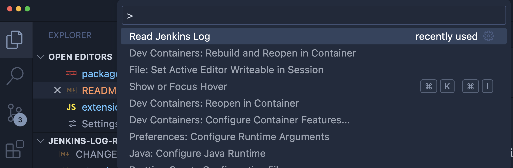

# Jenkins Log Reader

## Overview

This Visual Studio Code extension allows you to leverage a local AI model to analyze Jenkins logs and determine the reasons for job failures. The extension enhances the developer experience by providing an intuitive interface for log analysis directly within Visual Studio Code.

## Features

- **Seamless Integration**: Quick access to Jenkins logs via easy-to-use commands.
- **AI-Powered Insights**: Leverages local AI models for in-depth log analysis and failure reason identification.
- **Customizable Settings**: Tailor the extension to suit your Jenkins environment and AI model preferences.
- **Security**: It supposes to use local AI, then the sensitive data will not be transfer to outside of the company. Although you can also choose AI in the cloud.
- **Format Jenkinsfile**: Format Jenkinsfile and Groovy, the format is hardcode at the moment, will improve it later.

## Requirements

To use this extension, you must have a local AI model installed. We recommend using [Ollama](https://ollama.com/) with the `llama3` model.

1. Install Ollama from [here](https://ollama.com/download).
2. Get the `llama3` model:
   - Run `ollama run llama3` or `ollama pull llama3`.

## How to Use

1. Press **Command + Shift + P** (on Windows: **Ctrl + Shift + P**) and select **Read Jenkins Log** to activate the extension, or use the shortcut **Command + R** (Windows: **Ctrl + R**).
   
2. Press **Refresh** button to retrive the Jenkins build logs from Jenkins Server defined in extension settings.
3. Then you can click **Batch** button to analyse all builds listed. Or click one of the builds, click the **Analyse** button at the bottom, then local AI will try to figure out the root cause of failure.
4. A web view will appear at the left side, showing the tail of the build log followed by the AI analysis.
5. If you are not satisfy with the AI's result, fill your finding or solution into the text area at the bottom, click **Resolve**, then your input will be saved for future AI training or store in the RAG.

## Extension Settings

This extension introduces the following configurable settings:

- **`jenkins-log-reader.jenkinsLogSize`**: Set the maximum size of the log to analyze; default is **5120**.
- **`jenkins-log-reader.jenkinsUsername`**: Your Jenkins username.
- **`jenkins-log-reader.jenkinsToken`**: Your Jenkins token for authentication.
- **`jenkins-log-reader.aiModelUrl`**: Local AI REST API endpoint; default is **http://localhost:11434/v1**.
- **`jenkins-log-reader.aiModel`**: Specify the AI model for log analysis; default is **llama3**.
- **`jenkins-log-reader.aiPrompt`**: Custom prompt for the AI model, where `\$PROMPT\$` will be replaced with log information.

Example Prompt:

```
Analyze the following Jenkins job log to identify causes of failure. Provide:
1. A summary of the main error.
2. Specific error messages.
3. Suggestions for fixes.
4. Recurring issues in the log.
Here is the Jenkins job log: \$PROMPT\$
```

- **`jenkins-log-reader.aiTemperature`**: Controls creativity in AI responses; default is **0.6**.

## Known Issues

- Results may not always be meaningful; rerun the analysis for different insights.
- Incorrect formatting may occur due to the markdown to HTML conversion issues; fixes are pending.

## Additional Information

- [Visual Studio Code's Markdown Support](http://code.visualstudio.com/docs/languages/markdown)
- [Markdown Syntax Reference](https://help.github.com/articles/markdown-basics/)

## Disclaimer

This extension is a proof of concept and may have limitations or bugs. Your feedback is valuable for future improvements. If you enjoy using this extension, consider [buying me a coffee ☕️ ](https://www.buymeacoffee.com/huangjien) to support my work!

<div>
    <a href="https://www.buymeacoffee.com/huangjien" target="_blank" style="display: inline-block;">
        
    </a>
</div>
<br />

**Enjoy!**
